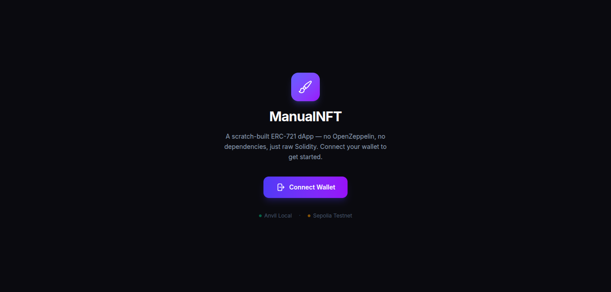
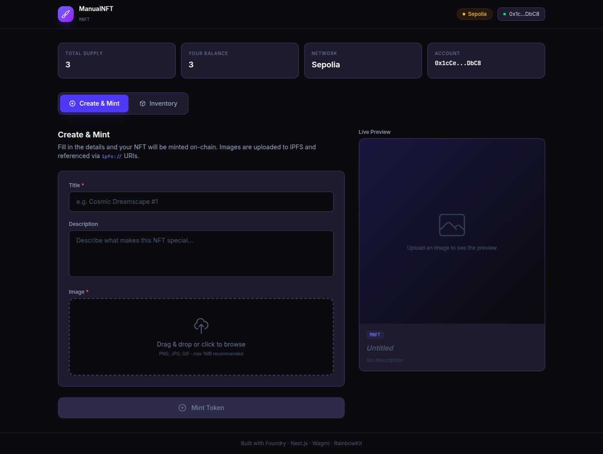
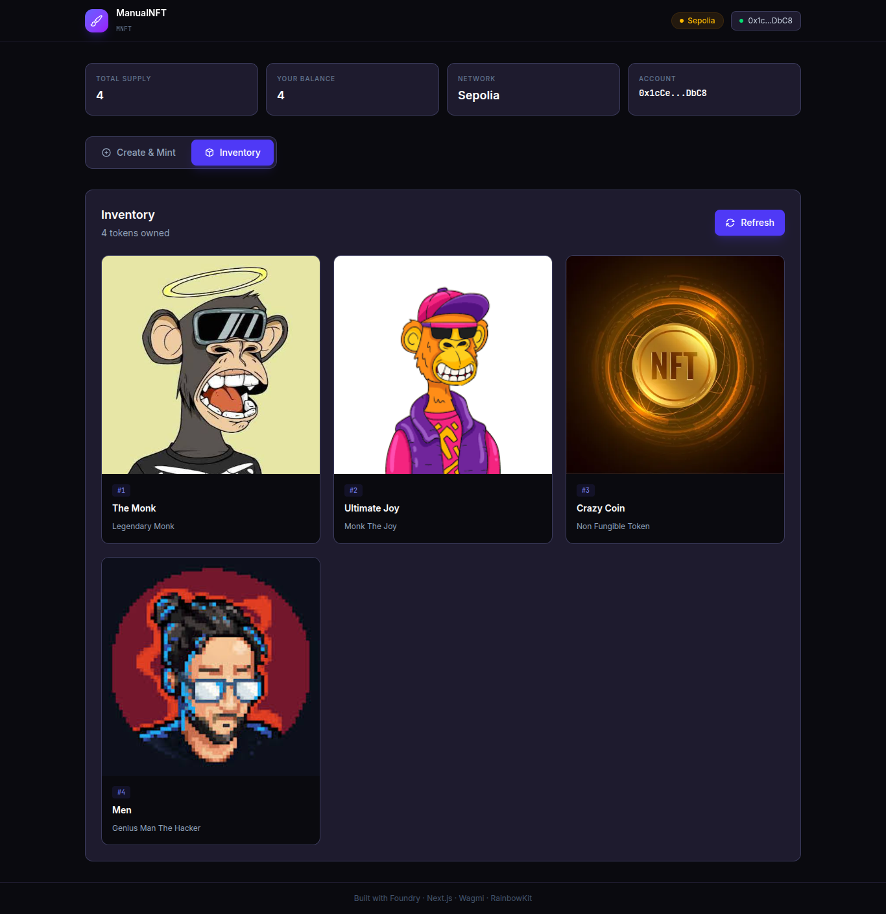

# ManualNFT dApp

A production-grade, single-repository (**monorepo**) decentralized application (dApp) featuring a scratch-built, custom ERC-721 NFT contract with full NatSpec documentation and a Next.js frontend. **Zero OpenZeppelin dependencies** — every contract primitive is built from first principles.

Images are uploaded to IPFS at mint time — you can use either **IPFS Desktop** (local, for Anvil development) or **Pinata** (remote, for Sepolia/production), configured via environment variables.

---

## 🏗️ Architecture

```
08_nft_with_frontend_by_freebuff/
├── contracts/               # Foundry workspace (Solidity)
│   ├── src/
│   │   └── ManualNFT.sol    # Custom ERC-721 (no OZ)
│   ├── script/
│   │   └── DeployManualNFT.s.sol  # Interactive deployment
│   ├── test/
│   │   └── ManualNFT.t.sol  # 34 fuzz + unit tests
│   ├── broadcast/           # Deployment receipts (auto-generated)
│   ├── foundry.toml
│   └── remappings.txt
├── frontend/                # Next.js 16 App Router + TypeScript
│   ├── src/
│   │   ├── app/
│   │   │   ├── layout.tsx   # Root layout with Web3Providers
│   │   │   ├── page.tsx     # Dashboard (create, mint, inventory)
│   │   │   └── globals.css  # TailwindCSS v4 styles
│   │   ├── components/
│   │   │   └── Providers.tsx  # Wagmi + RainbowKit + React Query
│   │   ├── hooks/
│   │   │   └── useInventory.ts  # Token inventory fetcher
│   │   ├── lib/
│   │   │   ├── wagmi.ts     # Wagmi/RainbowKit config
│   │   │   └── ipfs.ts      # IPFS upload + resolution (local & Pinata)
│   │   ├── generated.ts     # Type-safe hooks (auto-generated)
│   │   └── __tests__/       # Frontend tests
│   ├── wagmi.config.ts      # @wagmi/cli → foundry plugin
│   └── vitest.config.ts
├── scripts/
│   └── extract-address.sh   # Auto-extract contract address post-deploy
├── Makefile                 # Single-command orchestration
└── README.md
```

---

## 📸 Screenshots

| Connect Wallet | Dashboard & Mint | Token Inventory |
|:--------------:|:----------------:|:---------------:|
|  |  |  |

---

## 🛠️ Tech Stack

| Layer           | Technology                                            |
| --------------- | ----------------------------------------------------- |
| **Chain**       | Anvil (local) / Sepolia (testnet)                     |
| **Contracts**   | Solidity ^0.8.20, Foundry (forge, cast, anvil)        |
| **Frontend**    | Next.js 16 (App Router), TypeScript, TailwindCSS v4   |
| **Web3**        | Wagmi v2 + RainbowKit + Viem v2                       |
| **IPFS**        | IPFS Desktop (local) / Pinata (production)            |
| **Type Gen**    | @wagmi/cli Foundry plugin → React hooks               |
| **Testing**     | Forge (contracts), Vitest + RTL (frontend)            |

---

## 🚀 Quick Start

### Prerequisites

```bash
# Install Foundry
curl -L https://foundry.paradigm.xyz | bash
foundryup

# Node.js >= 18
node --version
```

### 1. Install Everything

```bash
make install-all
```

Installs Foundry dependencies (`forge-std`) and all npm packages in one command.

### 2. Configure Environment

```bash
cp frontend/.env.example frontend/.env.local
cp .env.example .env
```

**Required variables:**
| Variable | Where to get it |
|---|---|
| `NEXT_PUBLIC_WC_PROJECT_ID` | [WalletConnect Cloud](https://cloud.walletconnect.com) |
| `NEXT_PUBLIC_SEPOLIA_RPC` | [Alchemy](https://alchemy.com) or [Infura](https://infura.io) |
| `SEPOLIA_RPC` | Same RPC URL, but in the root `.env` for Foundry |

### 3. Start Anvil Node

```bash
anvil
# Keep this terminal open — Anvil runs a local Ethereum node on :8545
```

### 4. Start IPFS Desktop

Make sure **IPFS Desktop** is running. It exposes:
- **API**: `http://127.0.0.1:5001` (used by the app to upload)
- **Gateway**: `http://127.0.0.1:8080` (used by the app to display images)

No additional configuration needed — the app defaults to these endpoints.

### 5. Deploy Contracts (Local)

```bash
make deploy-anvil
```

You'll be prompted to paste the **default Anvil private key**:
```
0xac0974bec39a17e36ba4a6b4d238ff944bacb478cbed5efcae784d7bf4f2ff80
```

This one command:
1. ✅ Builds contracts
2. ✅ Deploys ManualNFT via `forge script --broadcast`
3. ✅ Auto-extracts the deployed contract address from broadcast logs
4. ✅ Writes `NEXT_PUBLIC_CONTRACT_ADDRESS` to `frontend/.env.local`
5. ✅ Regenerates Wagmi type-safe hooks

### 6. Start Frontend

```bash
make frontend-dev
```

Open [http://localhost:3000](http://localhost:3000), connect your wallet (set Anvil chain in RainbowKit), and start minting!

---

## 🖼️ IPFS Integration

### How it works

When you click **Mint Token**, the flow is:

```
1. User uploads image
        ↓
2. App uploads image to IPFS (via local API or Pinata)
        ↓                          ← NEXT_PUBLIC_IPFS_PROVIDER selects which
3. IPFS returns CID                 ← ipfs://QmX...
        ↓
4. Metadata JSON built with image: "ipfs://<CID>"
        ↓
5. Metadata base64-encoded → stored on-chain as tokenURI
        ↓
6. Wallet confirms transaction → Token minted!
```

The metadata JSON (name, description, ipfs:// image URL) is stored **on-chain** as a base64-encoded data URI — this keeps the metadata immutable and cheap. Only the image file is uploaded to IPFS.

### Provider Selection

| Variable | Anvil (Local) | Sepolia (Production) |
|---|---|---|
| `NEXT_PUBLIC_IPFS_PROVIDER` | `local` | `pinata` |
| IPFS Service | IPFS Desktop (running on your machine) | Pinata cloud service |
| API Endpoint | `http://127.0.0.1:5001` | `https://api.pinata.cloud` |
| Gateway | `http://127.0.0.1:8080` | `https://gateway.pinata.cloud` |

Set the env var in `frontend/.env.local` to switch between providers.

### Local IPFS Desktop (for Anvil)

1. Download and install [IPFS Desktop](https://docs.ipfs.tech/install/ipfs-desktop/)
2. Launch the application — it starts the API and gateway automatically
3. Verify it's running:
   ```bash
   curl http://127.0.0.1:5001/api/v0/version
   # {"Version":"0.29.0","Commit":"...","Repo":"17","System":"amd64/linux","Golang":"go1.22.5"}
   ```
4. Default ports: `5001` (API) and `8080` (gateway) — configurable via env vars

No env var changes needed — the app defaults to `local` provider with standard ports.

### Pinata (for Sepolia)

1. Create a free account at [Pinata](https://app.pinata.cloud)
2. Go to **API Keys** → **New Key** → enable `pinFileToIPFS`
3. Copy the **JWT** token
4. Set in `frontend/.env.local`:
   ```
   NEXT_PUBLIC_IPFS_PROVIDER=pinata
   NEXT_PUBLIC_PINATA_JWT=eyJhbGciOiJIUzI1NiIsInR5cCI6IkpXVCJ9...
   ```

---

## 🔄 Full Development Workflow

### One-Command Dev Loop

```bash
make dev-env
```

This builds contracts, generates wagmi types, and starts the frontend dev server.

### Deploy to Sepolia

```bash
make deploy-sepolia
```

You'll be prompted for your Sepolia deployer private key. The contract address is automatically extracted and configured for the frontend.

---

## 🧪 Testing

### Contract Tests (34 tests)

```bash
make contracts-test
```

The test suite covers:
- **Mint**: Basic minting, supply tracking, event emission
- **Transfer**: Standard + safe transfers, ownership changes
- **Approvals**: Single (`approve`/`getApproved`) + operator (`setApprovalForAll`/`isApprovedForAll`)
- **Enumeration**: `totalSupply`, `tokenByIndex`, `tokenOfOwnerByIndex`
- **ERC-165**: Interface detection
- **Edge cases**: Zero address reverts, non-existent token access, self-approval, duplicate mint prevention
- **Receiver contracts**: ERC-721 receiver accepts, ERC-721 rejector reverts
- **Fuzz tests**: Multi-address minting + enumeration (`vm.assume`)

### Frontend Tests

```bash
make frontend-test
```

Runs Vitest + React Testing Library smoke tests:
- Verifies the "Connect Wallet" landing page renders correctly
- Checks for proper heading and CTA button

---

## 📜 Smart Contract: ManualNFT

### How it works (technical deep-dive)

Every ERC-721 function is implemented by hand — **no OpenZeppelin imports**:

```
ManualNFT
├── State Ledgers
│   ├── _owners: tokenId → address          (ownership)
│   ├── _balances: owner → uint256          (balance tracking)
│   ├── _tokenApprovals: tokenId → address  (per-token approval)
│   ├── _operatorApprovals: owner → mapping (operator approvals)
│   ├── _tokenURIs: tokenId → string        (metadata URIs)
│   ├── _ownedTokens: owner → array         (enumeration helper)
│   ├── _ownedTokensIndex: tokenId → index  (enumeration helper)
│   ├── _allTokens: array                   (global token list)
│   └── _allTokensIndex: tokenId → index    (global index)
│
├── Core Operations
│   ├── mint(to, uri) → tokenId
│   ├── transferFrom(from, to, tokenId)
│   ├── safeTransferFrom(from, to, tokenId, data)
│   ├── approve(to, tokenId)
│   └── setApprovalForAll(operator, approved)
│
├── View Functions
│   ├── name() / symbol()
│   ├── tokenURI(tokenId)
│   ├── balanceOf(owner)
│   ├── ownerOf(tokenId)
│   ├── getApproved(tokenId)
│   ├── isApprovedForAll(owner, operator)
│   ├── supportsInterface(interfaceId)       → ERC-165
│   ├── totalSupply()                         → Enumerable
│   ├── tokenByIndex(index)                   → Enumerable
│   └── tokenOfOwnerByIndex(owner, index)    → Enumerable
│
└── Internal
    ├── _mint(to, tokenId)
    ├── _beforeTokenTransfer(from, to, tokenId)
    ├── _checkOnERC721Received(operator, from, to, tokenId, data)
    └── _baseURI()
```

**Custom errors** (gas-optimized, no string asserts):
- `NFT__NotAuthorized()` — caller lacks permission
- `NFT__NonexistentToken()` — querying a burnt/non-existent token
- `NFT__InvalidOwner()` — owner address mismatch
- `NFT__InvalidRecipient()` — minting/transferring to zero address
- `NFT__NonERC721Receiver()` — contract doesn't implement `onERC721Received`

### Deployment Script: How `--interactives` works

```solidity
// Priority:
//   1. PRIVATE_KEY environment variable (CI/automated)
//   2. Interactive prompt (--interactives 1, secure)
uint256 deployerPrivateKey = vm.envOr("PRIVATE_KEY", uint256(0));

if (deployerPrivateKey == 0) {
    string memory pkHex = vm.promptSecret("Enter private key...");
    deployerPrivateKey = vm.parseUint(pkHex);
}
```

`vm.promptSecret` is a Foundry cheatcode that securely reads input without echoing it to the terminal or storing it in bash history.

---

## 🖥️ Frontend Architecture

### Component Tree

```
Providers (WagmiProvider → QueryClient → RainbowKitProvider)
└── Home (page.tsx)
    ├── Mount guard (hydration safety)
    ├── [Not connected] Connect Wallet screen
    └── [Connected] Dashboard
        ├── Header (stats bar, network badge, wallet button)
        ├── Tab bar (Create & Mint | Inventory)
        ├── Create & Mint (AssetCreationForm)
        │   ├── Title / Description / Image upload (drag & drop)
        │   ├── IPFS upload (local Desktop or Pinata)
        │   ├── Live preview panel
        │   └── Mint button + toast notifications
        └── Inventory (InventoryPanel)
            ├── Token grid with IPFS-resolved images
            └── Refresh button
```

### IPFS Upload Flow (detailed)

```
┌─────────────────────────────────────────────────────────┐
│  handleMint()                                           │
│  ┌───────────────────────────────────────────────────┐  │
│  │  1. setIsUploadingIPFS(true)                      │  │
│  │  2. uploadToIPFS(selectedFile)                    │  │
│  │     ├─ provider === "local"                       │  │
│  │     │  └─ POST /api/v0/add to 127.0.0.1:5001     │  │
│  │     └─ provider === "pinata"                      │  │
│  │        └─ POST pinFileToIPFS to api.pinata.cloud  │  │
│  │  3. Returns { cid, uri: "ipfs://<cid>" }          │  │
│  │  4. Build metadata: { image: "ipfs://<cid>" }     │  │
│  │  5. Base64-encode metadata → tokenURI             │  │
│  │  6. mintToken({ args: [address, uri] })           │  │
│  └───────────────────────────────────────────────────┘  │
└─────────────────────────────────────────────────────────┘

┌─────────────────────────────────────────────────────────┐
│  useInventory() (fetchInventory)                        │
│  ┌───────────────────────────────────────────────────┐  │
│  │  1. balanceOf(address) → count                    │  │
│  │  2. For each token:                               │  │
│  │     ├─ tokenOfOwnerByIndex(owner, i) → tokenId    │  │
│  │     ├─ tokenURI(tokenId) → "data:..."              │  │
│  │     ├─ atob() → JSON.parse → metadata              │  │
│  │     └─ resolveIPFS(metadata.image) → gateway URL   │  │
│  └───────────────────────────────────────────────────┘  │
│  Returns TokenInfo[] with resolved image URLs           │
└─────────────────────────────────────────────────────────┘
```

### State Management

- **Wallet state**: Wagmi's `useAccount()` — reactive address + connection status
- **Contract reads**: Generated `useReadManualNft*` hooks (auto-refetch on address/chain changes)
- **Contract writes**: Generated `useWriteManualNftMint` hook (returns transaction hash)
- **IPFS upload**: Custom `uploadToIPFS()` — async, shows loading state, errors propagate to toast
- **Inventory**: Custom `useInventory` hook — iterates `tokenOfOwnerByIndex` + `tokenURI` for each token, resolves IPFS URIs
- **Local state**: React `useState` for form fields, toast, UI tabs

### Type-Safe Contract Binding (`@wagmi/cli`)

The file `frontend/wagmi.config.ts` uses the Foundry plugin to read `contracts/out/ManualNFT.sol/ManualNFT.json` and generate `frontend/src/generated.ts`. This means:

- ✅ **Full TypeScript types** — function names, inputs, outputs, events, errors
- ✅ **React hooks** — `useReadManualNft*`, `useWriteManualNft*`, `useSimulateManualNft*`, `useWatchManualNft*`
- ✅ **Zero ABI copy-pasting** — regenerate after any contract change via `make wagmi-gen`

---

## 🔄 Deployment Pipeline (Auto-Address Extraction)

When you run `make deploy-anvil` or `make deploy-sepolia`:

1. **`forge script`** deploys the contract and writes broadcast logs to `contracts/broadcast/DeployManualNFT.s.sol/<chainid>/run-latest.json`
2. **`scripts/extract-address.sh`** parses the JSON and extracts the `contractAddress`
3. The script writes `NEXT_PUBLIC_CONTRACT_ADDRESS=<address>` to `frontend/.env.local`
4. **`make wagmi-gen`** regenerates type-safe hooks

You never need to manually copy-paste the contract address.

---

## 📦 Makefile Commands

| Command | Description |
|---|---|
| **`make install-all`** | Install all deps (contracts + frontend) |
| **`make contracts-build`** | Compile Solidity with forge |
| **`make contracts-test`** | Run 34 contract tests (+vvvv) |
| **`make wagmi-gen`** | Build contracts + generate React hooks |
| **`make deploy-anvil`** | Deploy to localhost:8545 + inject address |
| **`make deploy-sepolia`** | Deploy to Sepolia + inject address |
| **`make post-deploy-setup`** | Extract address + regenerate types |
| **`make frontend-dev`** | Start Next.js dev server |
| **`make frontend-build`** | Production build |
| **`make frontend-test`** | Run Vitest frontend tests |
| **`make dev-env`** | Build → types → dev server |
| **`make clean`** | Remove artifacts |

---

## ⚙️ Environment Variables

### `frontend/.env.local`

| Variable | Required | Default | Description |
|---|---|---|---|
| `NEXT_PUBLIC_WC_PROJECT_ID` | ✅ Yes | — | WalletConnect Project ID |
| `NEXT_PUBLIC_ANVIL_RPC` | ❌ No | `http://localhost:8545` | Anvil RPC URL |
| `NEXT_PUBLIC_SEPOLIA_RPC` | For Sepolia | — | Sepolia RPC URL |
| `NEXT_PUBLIC_CONTRACT_ADDRESS` | After deploy | — | Set automatically by `make deploy-*` |
| `NEXT_PUBLIC_IPFS_PROVIDER` | ❌ No | `local` | `local` or `pinata` |
| `NEXT_PUBLIC_LOCAL_IPFS_API` | ❌ No | `http://127.0.0.1:5001` | IPFS Desktop API URL |
| `NEXT_PUBLIC_LOCAL_IPFS_GATEWAY` | ❌ No | `http://127.0.0.1:8080` | IPFS Desktop gateway URL |
| `NEXT_PUBLIC_PINATA_JWT` | For Pinata | — | Pinata JWT token |
| `NEXT_PUBLIC_PINATA_GATEWAY` | ❌ No | `https://gateway.pinata.cloud` | Pinata gateway URL |

### Root `.env`

| Variable | Required | Description |
|---|---|---|
| `SEPOLIA_RPC` | For Sepolia deploy | RPC URL used by `forge script` |
